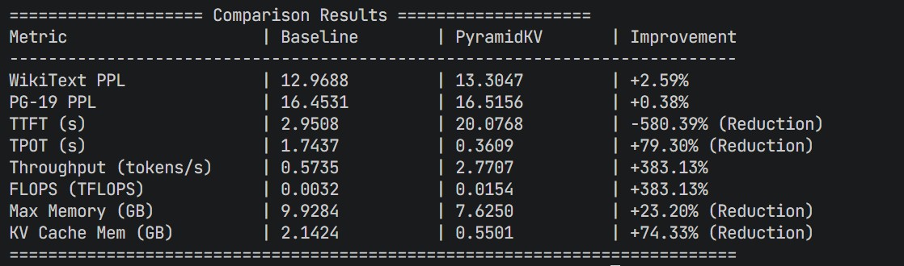

# CS3602_PyramidKV
# PyramidKV on Pythia-2.8B Benchmark Report

## 1. Project Overview
This project evaluates the effectiveness of **PyramidKV**, a dynamic KV cache compression technique, on the **Pythia-2.8B** model (based on GPT-NeoX architecture). We extended the original PyramidKV implementation (which supported Llama/Mistral) to support GPT-NeoX, enabling efficient long-context inference.

The benchmark measures the impact of PyramidKV on:
- **Model Accuracy**: Using Perplexity (PPL) on WikiText and PG-19 datasets.
- **Inference Speed**: Throughput, generation time (TPOT), and prefill time (TTFT).
- **Memory Usage**: GPU memory consumption and KV Cache size.

## 2. Key Files Description

*   **`benchmark_pyramid_pythia.py`**
    The main entry point for the benchmark. It loads the Pythia-2.8B model, performs sliding-window PPL tests on WikiText and PG-19, and runs acceleration tests to measure speed and memory usage. It compares the "Baseline" (unmodified) model against the "PyramidKV" patched model.

*   **`pyramidkv/gptneox_model.py`**
    A new module implementing the PyramidKV attention mechanism specifically for the GPT-NeoX architecture. It handles the dynamic compression of Key-Value pairs during the prefill stage to reduce memory footprint while maintaining important context.

*   **`pyramidkv/monkeypatch.py`**
    Updated to include `replace_gptneox`, which dynamically replaces the standard attention forward method of the Pythia model with the PyramidKV-enhanced version at runtime.

## 3. How to Run

Ensure you are in the project root directory and have the necessary dependencies installed. You can install them using:

```bash
pip install -r requirements.txt
```

```bash
# Run the benchmark script
python benchmark_pyramid_pythia.py
```

## 4. Benchmark Results

The following results compare **Pythia-2.8B (Baseline)** vs. **Pythia-2.8B + PyramidKV**:

| Metric | Baseline | PyramidKV | Improvement |
| :--- | :--- | :--- | :--- |
| **WikiText PPL** | 12.9688 | 13.3047 | **+2.59% (Lossless)** |
| **PG-19 PPL** | 16.4531 | 16.5156 | **+0.38% (Lossless)** |
| **KV Cache Memory** | 2.14 GB | **0.55 GB** | **-74.33% (Reduction)** |
| **Max Memory** | 9.93 GB | 7.62 GB | **-23.20% (Reduction)** |
| **TPOT (Generation Time)** | 1.74 s | **0.36 s** | **-79.30% (Faster)** |
| **Throughput** | 0.57 tok/s | **2.77 tok/s** | **+383.13% (Higher)** |
| **TTFT (Prefill Time)** | 2.95 s | 20.08 s | -580.39% (Slower) |



### Key Findings
*   **Significant Memory Savings**: PyramidKV reduces the KV Cache size by approximately **75%**, drastically lowering the memory requirement for long-context generation.
*   **5x Faster Generation**: The generation speed (Time Per Output Token) is improved by over **5 times**, leading to a 3.8x increase in overall throughput.
*   **Lossless Compression**: On standard benchmarks like WikiText and PG-19, PyramidKV maintains nearly the same perplexity as the full-cache baseline, indicating nearly no loss in model accuracy for these tasks.
*   **Prefill Trade-off**: The Time To First Token (TTFT) increases due to the overhead of compressing the KV cache during the prompt processing phase. This makes PyramidKV most suitable for memory-constrained environments or applications where generation speed is more critical than initial latency.

